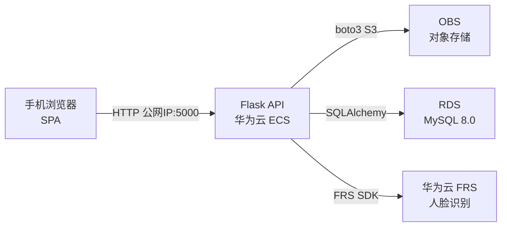

# 人脸签到系统简要设计文档

> **团队成员**：`罗抒怀 231880343` `叶兆勋 231880046`

---

## 1. 项目概述

基于手机端拍照上传、云端人脸识别检索的签到系统。用户注册时录入标准人脸照片，后续签到无需登录，服务器通过人脸检索自动匹配身份并记录签到。

**核心功能**：注册（含人脸录入）、登录/注销、无登录人脸签到、签到记录查看（需登录）、照片库管理（需登录）。

## 2. 系统架构

- **手机端**：单页 Web 应用，拍照/选图后通过 HTTP 请求与服务器交互
- **Flask API**：部署在华为云 ECS，绑定公网 IP，负责路由分发、业务编排和 session 管理
- **OBS**：S3 兼容协议存储用户标准照和签到照，生成公网可访问 URL
- **RDS**：MySQL 8.0，持久化用户信息和签到记录，与 ECS 同 VPC 内网访问
- **FRS**：华为云人脸识别服务，提供人脸检测、特征提取和 1:N 检索

## 3. 模型选择

### 3.1 当前方案：华为云 FRS

选用华为云托管的人脸识别服务，通过 SDK 调用 API 完成人脸检测、特征提取和人脸库搜索。

### 3.2 演进方向：自建视觉模型 + 向量检索

当并发超过 FRS QPS 上限或需要可控的特征数据时，切换到自建方案：

| 阶段     | 模型                | 用途                        |
| -------- | ------------------- | --------------------------- |
| 人脸检测 | MTCNN / RetinaFace  | 定位照片中人脸位置          |
| 特征编码 | ArcFace (ResNet-50) | 将人脸编码为 512 维特征向量 |
| 向量检索 | Faiss / Milvus      | 对特征向量做 1:N 相似度检索 |

自建方案需额外引入推理队列（Redis/Kafka）解耦上传与推理，将同步签到拆分为异步处理链路。

### 3.3 检索策略

- **阈值**：`FACE_SEARCH_THRESHOLD = 0.85`，置信度不足直接拒绝
- **多脸**：照片中存在多张高置信度人脸时拒绝签到；仅第二张置信度远低于阈值（< 阈值 × 0.8）时才使用最佳匹配
- 策略偏向安全：宁可拒签也不错签

## 4. 数据模型

### users

| 字段       | 类型               | 说明                    |
| ---------- | ------------------ | ----------------------- |
| id         | INT PK             | 自增                    |
| username   | VARCHAR(50) UNIQUE | 登录凭证                |
| password   | VARCHAR(255)       | salted 哈希（werkzeug） |
| real_name  | VARCHAR(50)        | 签到展示用              |
| face_url   | VARCHAR(500)       | 标准照 OBS URL          |
| face_id    | VARCHAR(100)       | FRS 人脸库 ID           |
| created_at | TIMESTAMP          | 注册时间                |

### checkin_records

| 字段         | 类型         | 说明           |
| ------------ | ------------ | -------------- |
| id           | INT PK       | 自增           |
| user_id      | INT          | 关联用户       |
| checkin_time | TIMESTAMP    | 签到时间       |
| confidence   | FLOAT        | 匹配置信度     |
| photo_url    | VARCHAR(500) | 签到照 OBS URL |

## 5. 关键设计决策

### 5.1 签到无需登录

签到接口不要求 session，仅凭照片中的人脸检索匹配用户。手机端无法通过设备信息关联用户身份，用户隐私由人脸检索过程隔离——只有匹配成功才会关联到具体人员。

### 5.2 多脸与低置信度拒绝

拍照画面质量不可控，可能出现多人合影或模糊照片。采用"高阈值 + 多脸拒绝"策略，避免将路人误签到他人工时。

### 5.3 记录访问隔离

签到记录和照片库接口通过 session 校验，仅返回当前登录用户本人的数据，不可通过参数指定 user_id 查看他人信息。

### 5.4 高并发演进预留

当前 Flask 同步模型仅适合原型验证。后续可拆分为上传服务、推理队列、向量检索服务和记录写入服务四个独立组件，各组件可独立扩缩容。

### 5.5 密码安全

用户密码使用 werkzeug 提供的 salted 哈希算法存储，不可逆。即使数据库泄露，密码原文也不会暴露。

## 6. 部署说明

| 资源     | 选型                 | 说明                              |
| -------- | -------------------- | --------------------------------- |
| 计算     | 华为云 ECS           | 单台，绑定公网 IP，开放 5000 端口 |
| 存储     | 华为云 OBS           | 桶设公共读，照片 URL 可直访       |
| 数据库   | 华为云 RDS MySQL 8.0 | 与 ECS 同 VPC 内网互通            |
| 人脸服务 | 华为云 FRS           | AK/SK 认证，API 调用              |

## 7. 边界条件处理

| 场景              | 策略                                        |
| ----------------- | ------------------------------------------- |
| 照片无清晰人脸    | FRS 检测失败，提示重新拍照                  |
| 未录入人员签到    | 置信度低于阈值，拒绝匹配                    |
| 照片多张人脸      | 高置信度多脸 → 拒绝；仅最佳脸高分 → 通过    |
| 重复注册          | username UNIQUE 约束，拒绝重复              |
| 图片过大/格式不对 | 后端校验扩展名 + 文件大小（≤10MB，jpg/png） |
| 云服务不可用      | 捕获异常，返回可理解的错误信息              |

## 8. 技术栈

| 层         | 选型              | 版本    |
| ---------- | ----------------- | ------- |
| Web 框架   | Flask             | 2.3.3   |
| 跨域       | flask-cors        | 4.0.0   |
| ORM        | SQLAlchemy        | 1.4.50  |
| 数据库驱动 | PyMySQL           | 1.1.0   |
| 对象存储   | boto3 (S3 兼容)   | 1.34.69 |
| 人脸识别   | 华为云 FRS SDK    | latest  |
| 密码哈希   | werkzeug.security | 2.3.7   |
